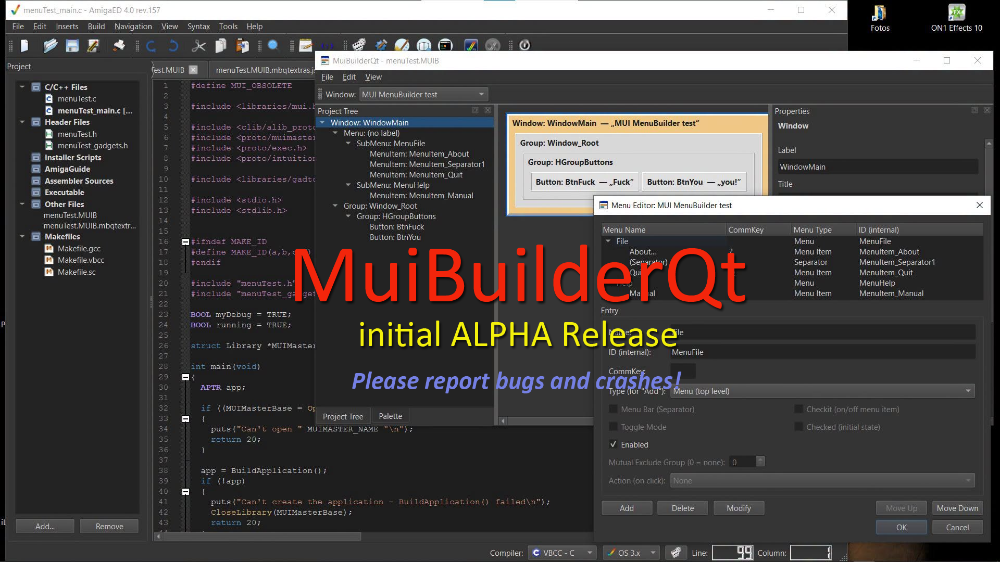

<p align="center">
  
</p>

# MuiBuilderQt

**MuiBuilderQt** is a modern Qt6/C++ port of Eric Totel's classic **MUI-Builder** (v2.3) — an interactive GUI designer for Amiga's [MUI (Magic User Interface)](https://en.wikipedia.org/wiki/Magic_User_Interface) toolkit. Drag widgets onto a canvas, wire up notifications, edit menus, and generate ready-to-compile MUI C code for `m68k-amigaos-gcc` or `vbcc` — running natively on Windows, Linux and macOS.

MuiBuilderQt is a sub-project of [AmigaED](https://github.com/mbergmann-sh/AmigaED4-IDE), the Amiga cross-development IDE, but works perfectly well on its own.

> ## ⚠️ ALPHA status
>
> **This is an early alpha release.** The core engine (loading/saving `.MUIB` files, C code generation) has been validated against 15 real MUI-Builder example projects plus several real-world user projects compiled and tested with actual Amiga toolchains and emulators — but the software is young, some corners of the original MUI-Builder feature set aren't covered yet, and you *will* run into rough edges.
>
> **Please report bugs and crashes** — via [GitHub Issues](../../issues). Every report helps get this to a stable 1.0 faster.

---

## Table of contents

- [What it does](#what-it-does)
- [Features](#features)
- [Known limitations (alpha)](#known-limitations-alpha)
- [Building](#building)
- [Using it with AmigaED](#using-it-with-amigaed)
- [Origin & license](#origin--license)
- [Contributing / bug reports](#contributing--bug-reports)

---

## What it does

You build a MUI GUI interactively — windows, groups, buttons, text fields, lists, menus, and everything else MUI offers — by dragging widgets onto a canvas and editing their properties in an inspector, exactly like the original Amiga MUI-Builder. When you're happy with it, **Generate Code** turns your design into real, structurally-correct MUI C code you compile with your own Amiga toolchain and run on real hardware, WinUAE, or FS-UAE.

## Features

**Interactive designer**
- Widget palette with all 20 real MUI widget types (Group, Button, Text, String, Listview, Cycle, Radio, Check, Slider, Gauge, Image, Dirlist, PopAsl, PopObject, and more), placed via drag & drop
- Live canvas that mirrors the actual object tree, with in-place drag-to-reorder of siblings inside a group
- Property inspector with per-type relevant fields (not a "kitchen sink" of every possible attribute)
- Project tree showing every window and its menu structure
- Multiple windows per project, with a window switcher
- Recent Projects menu

**Menus**
- Full interactive menu editor (add/delete/move/rename menus, submenus and items; separators; shortcuts; checkmarks and mutually-exclusive groups)
- Curated "Action" wiring for common menu behaviour (Quit, open/close/activate a window) without touching code
- Every menu item can get an auto-generated debug stub, wired up out of the box, so you can see it fire before you write a single line of your own logic

**Application-level features**
- Application Properties dialog (title, version, copyright, author, description, base name, help file)
- AboutBox creator (image, text, URL, linked to a menu item of your choice) using the real `Aboutbox.mcc` class
- Configurable window position (centered / under mouse pointer / manual X,Y) and window size (min/max width/height) — features the original MUI-Builder never had
- Debug-stub generation for every notifiable gadget (button, string, cycle, radio, check, slider, listview, dirlist), each printing its current live content to the console when triggered

**Code generation**
- Produces four files per project: `<name>.h`, `<name>.c`, `<name>_main.c` (a complete, runnable `main()` with the standard MUI event loop) and `<name>_gadgets.h` (debug stubs)
- Uses real, verified MUI SDK macros and attributes throughout (cross-checked against the original MUI-Builder source and official MUI autodocs — no invented symbols)
- Validated against real `m68k-amigaos-gcc` and `vbcc`/NDK3.2 builds, with multiple real-world bugs found and fixed this way

**Quality of life**
- Full English/German UI with runtime language switching (View ▸ GUI Language)
- Five themes, including pixel-accurate Amiga Workbench 1.3/3.1 looks and a Visual Studio Code Dark theme, alongside every native Qt style
- Window layout (docks, splitters, size, position) is remembered between sessions

## Known limitations (alpha)

- No undo/redo yet (deleting an object is permanent within a session)
- Notifications aren't editable in the property inspector yet
- The application-wide menu (as opposed to a window's own menu) isn't editable in the GUI yet
- No catalog/locale (`.cd`), ARexx or icon tooltype support
- A handful of edge cases around cross-window notification targets aren't resolved automatically (documented in `CODEGEN_NOTES.md`)

None of these break normal use — they're simply not built yet. See `CODEGEN_NOTES.md` and `CHANGELOG.md` for the full technical detail behind every design decision and bugfix.

## Building

Requires Qt6 (Core, Gui, Widgets — no other dependencies).

```sh
cd gui
qmake6 MuiBuilderQt.pro   # Windows: qmake MuiBuilderQt.pro
make                      # Windows (MinGW): mingw32-make
./MuiBuilderQt [optional: path to a .MUIB file]
```

On Windows, a post-build step runs `windeployqt` automatically and stages a ready-to-install copy under `MuiBuilderQt_install/install_src`, which `MuiBuilderQt_install/MuiBuilderQt.iss` (Inno Setup) turns into a Windows installer.

## Using it with AmigaED

Starting with AmigaED rev.160, `File ▸ New Project ▸ GUI Builder Projects ▸ MUI` launches MuiBuilderQt directly to design a brand-new project's GUI. When you're done, `File ▸ Finalise AmigaED Project` in MuiBuilderQt saves the project, generates the C code, and hands the result straight back to AmigaED, which imports it (and adds `-lmui` to the project's linker options automatically). GadTools and ReAction builders using the same mechanism are planned.

MuiBuilderQt also works completely standalone — no AmigaED required.

## Origin & license

MuiBuilderQt is a from-scratch Qt6/C++ reimplementation (not a byte-for-byte port) of Eric Totel's **MUI-Builder v2.3**, based on its publicly available SVN source. No formal license accompanies the original source, and no permission from Eric Totel for this port has been confirmed. It is provided as-is, without warranty of any kind, in the spirit of the original tool and for the benefit of the remaining Amiga development community. If you are Eric Totel, or represent him, please get in touch.

This is **not** released under a formal open-source license (MIT/GPL/BSD/...) — see [`LICENSE`](LICENSE) for the exact terms under which the source and binaries are made available.

## Contributing / bug reports

This is an alpha. If something crashes, generates code that doesn't compile, or just behaves oddly — please [open an issue](../../issues) with your `.MUIB` file (or a minimal one that reproduces it) and the exact error message. That's exactly how most of the fixes in this release happened.
